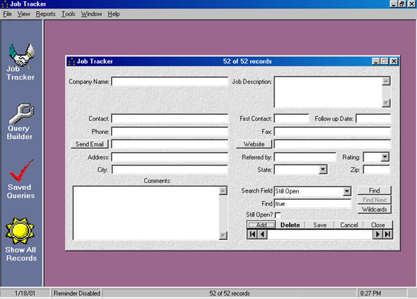



## A Job Tracker

### Description

This is the updated and greatly improved version of a job orgainizer that I had submitted last month. You can keep track of job prospects, saving the info in an Access database. You can search on any field. There is a query builder to build SQL queries for you, and it saves all the queries that you build. You can view and edit the saved Sql statements. It has a follow up reminder to let you know when you need to contact people. It prints a couple of basic reports. I found this program very useful in my last job search. I hope that you like it. Please let me know if you do or if you have suggestions to improve it.
 
### More Info
 

             |
---                |---
**Submitted On**   |2001-01-18 20:17:50
**By**             |[Rick B](https://github.com/Planet-Source-Code/PSCIndex/blob/master/ByAuthor/rick-b.md)
**Level**          |Intermediate
**User Rating**    |4.7 (71 globes from 15 users)
**Compatibility**  |VB 5\.0, VB 6\.0
**Category**       |[Complete Applications](https://github.com/Planet-Source-Code/PSCIndex/blob/master/ByCategory/complete-applications__1-27.md)
**World**          |[Visual Basic](https://github.com/Planet-Source-Code/PSCIndex/blob/master/ByWorld/visual-basic.md)
**Archive File**   |[CODE\_UPLOAD139061182001\.zip](https://github.com/Planet-Source-Code/rick-b-a-job-tracker__1-14523/archive/master.zip)

